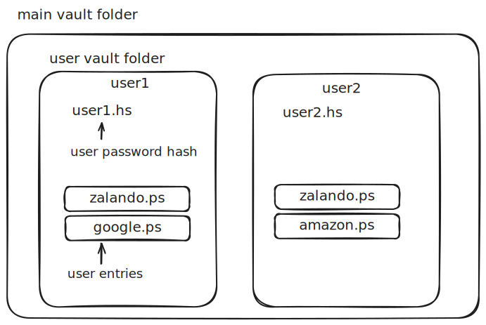

# Pass-Secure

<p align="center">

</p>

**Pass-Secure** est un gestionnaire de mots de passe TCP offrant des fonctionnalités de gestion de mots de passe dans un environnement client-serveur. Il permet d'interagir avec un serveur via des commandes pour enregistrer, récupérer, stocker ou supprimer des mots de passe. Pass-Secure permet une encryption coté client des mot de passe envoyés au serveur avec un autre mot de passe, ce qui ajoute un niveau de sécurité majeur. Le serveur n'a pas connaissance des mots de passe décryptés.

Les fichiers sont stockés sur le serveur selon l'arborescence suivante :


## Fonctionnalités

- **Enregistrement et Connexion des Utilisateurs** : Les utilisateurs peuvent créer un compte protégé par un mot de passe maître.
- **Stockage Sécurisé** : Les mots de passe sont chiffrés par le client et sauvegardés dans un coffre sur le serveur.
- **Récupération de Mots de Passe** : Permet aux utilisateurs d'accéder à leurs mots de passe stockés.
- **Suppression de Mots de Passe** : Les entrées inutiles peuvent être supprimées du coffre.
- **Déconnexion et Fermeture** : Permet de mettre fin à la session.

## Docker

1. Pull l'image docker
```bash
docker pull ghcr.io/leonardjouve/pass-secure
```


- Lancer le serveur
```bash
docker run ghcr.io/leonardjouve/pass-secure server
```

- Lancer le client 
```bash
docker run -it ghcr.io/leonardjouve/pass-secure client
```

Exemple d'utilisation en local:

1. Créer un réseau docker
```bash
docker network create pass-secure-network
```

2. Lancer le serveur
```bash
docker run --network pass-secure-network ghcr.io/leonardjouve/pass-secure server
```

3. Réccupérer l'ip du serveur
```bash
docker network inspect pass-secure-network
```
```
[
    {
        "Name": "pass-secure-network",
        ...
        "Containers": {
            "cd9d65afb592da4f35770d1e4012cc346d9fef442c9a577da556a5d2d658b5fe": {
                ...
                "IPv4Address": "172.22.0.2/16",
                ...
            }
        },
         ...
    }
]
```

4. Lancer le client
```bash
docker run --network pass-secure-network -it ghcr.io/leonardjouve/pass-secure client --host 172.22.0.2
```

## Installation

1. Clonez le dépôt :
   ```bash
   git clone https://github.com/LeonardJouve/DAI-labo-02.git
   cd DAI-labo-02
   ```

2. Compilez le projet :
   ```bash
   ./mvnw spotless:apply spotless:check dependency:go-offline clean compile package
   ```

3. Lancez le serveur :
   ```bash
   java -jar target/pass-secure-1.0.jar --path ./serverVault/ server --port 9765 --thread 5
   ```

4. Lancez le client :
   ```bash
   java -jar target/pass-secure-1.0.jar client --host localhost --port 9765
   ```

5. Obtenez de l'aide ou affichez la version :
   ```bash
   java -jar target/pass-secure-1.0.jar --help
   java -jar target/pass-secure-1.0.jar --version
   ```

## Usage

### Commandes disponibles

L'application fonctionne avec un protocole TCP personnalisé. Voici les commandes supportées côté client :

| **Commande**     | **Description**                                                             |
|-------------------|-----------------------------------------------------------------------------|
| `REGISTER`      | Enregistrer un nouvel utilisateur (requiert `--username` et `--password`). |
| `LOGIN`         | Connecter un utilisateur existant (requiert `--username` et `--password`). |
| `ADD`           | Ajouter un mot de passe au coffre (requiert `--name`, `--password` et `--overwrite`) (local `--encryptionPassword`).     |
| `GET`           | Récupérer un mot de passe du coffre (requiert `--name`) (local `--decryptionPassword`).                  |
| `REMOVE`        | Supprimer un mot de passe du coffre (requiert `--name`).                  |
| `DISCONNECT`    | Déconnecter l'utilisateur du serveur.                                      |
| `PING`          | Vérifier la connectivité avec le serveur.                                  |
| `QUIT`          | Fermer la connexion (client uniquement).                                   |
| `GENERATE`      | Creer un mot de passe sécurisé. (requiert `--length`, `--name` et `--overwrite` si `--store` est spécifié) (optionnal `--special`, `--store`).                                   |
| `HELP`          | Affiche un message d'aide (client uniquement) |

### Exemple de session client-serveur

#### Étapes :
1. Enregistrer un utilisateur
2. Connecter l'utilisateur
3. Ajouter un mot de passe
4. Récupérer un mot de passe
5. Déconnecter l'utilisateur

#### Exemple :
**Client** → `REGISTER --username alice --password 1234`  
**Serveur** → `OK`

**Client** → `ADD --name github --password securePass123 --encryptionPassword 1234`  
**Serveur** → `OK`

**Client** → `GET --name github`  
**Serveur** → `OK`  
**Serveur** → `rFMQGZ5LWQUCpCmNjmgrHYNPZrGktjm5dxZbmNg2hfs`

**Client** → `GET --name github --decryptionPassword 1234`  
**Serveur** → `OK`  
**Serveur** → `securePass123`

**Client** → `--disconnect`  
**Serveur** → `OK`

### Exemple de génération de mot de passe :
**Client** → `GENERATE --name twitter --length 12 --special true --store true`
**Client** → `rFMQ$Z5*WQ-C`
**Serveur** → `OK`

## Remarques importantes

- **Sécurité** : Les mots de passe sont chiffrés localement avec un mot de passe d'encryption pour chaque entrée.
- **Configuration** : Le serveur utilise par défaut le port `6433`. Assurez-vous qu'il est ouvert sur votre machine.
- **Dossier par défaut** : Les coffres-forts sont sauvegardés dans le répertoire spécifié ou, par défaut, dans le répertoire courant.

## Contributions

Pour signaler un bug ou proposer des améliorations, veuillez soumettre une issue sur le dépôt GitHub.
